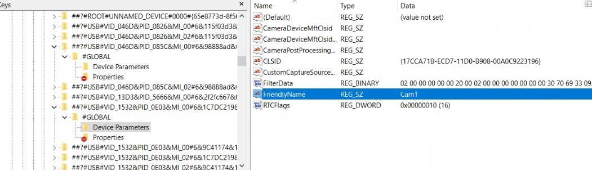

# Remote Webcam Control Server

This is a tool to control the webcam properties using a webserver. Making it possible to easily control webcam settings from somthing like [Streamerbot](https://streamer.bot/)

## Renaming cameras

The server requires you to provide the friendly name of a camera. This can be a problem if you have many of the same camera. Changing the name isnt hard.

1. Download [Registry Finder](https://registry-finder.com/) or use the windows built in regedit

2. Run the camera server. When the server starts find the current name of the camera you want to change. On the line below it will give you some text that looks like this `@device:pnp:\\?\usb#vid_1532&pid_0e03&mi_00#6&1c7dc219&2&0000#{65e8773d-8f56-11d0-a3b9-00a0c9223196}\global`

3. copy the section in bold @device:pnp:\\?\\**usb#vid_1532&pid_0e03&mi_00#6&1c7dc219&2&0000#{65e8773d-8f56-11d0-a3b9-00a0c9223196}**\global for me the text copied will be `usb#vid_1532&pid_0e03&mi_00#6&1c7dc219&2&0000#{65e8773d-8f56-11d0-a3b9-00a0c9223196}\global` we **dont** want the text to the left of `usb` or the `\global` at the end

4. now in Registry Finder or regedit, search for this text. You can search your entire regsitry, if find multiple results the correct result starts with `HKEY_LOCAL_MACHINE\SYSTEM\CurrentControlSet\`

inside of this there should be a `#GLOBAL` folder and inside it a `Device Parameters` folder.

From here change the `FriendlyName` to a new name. Then restart your webcam app and the new name should appear.
